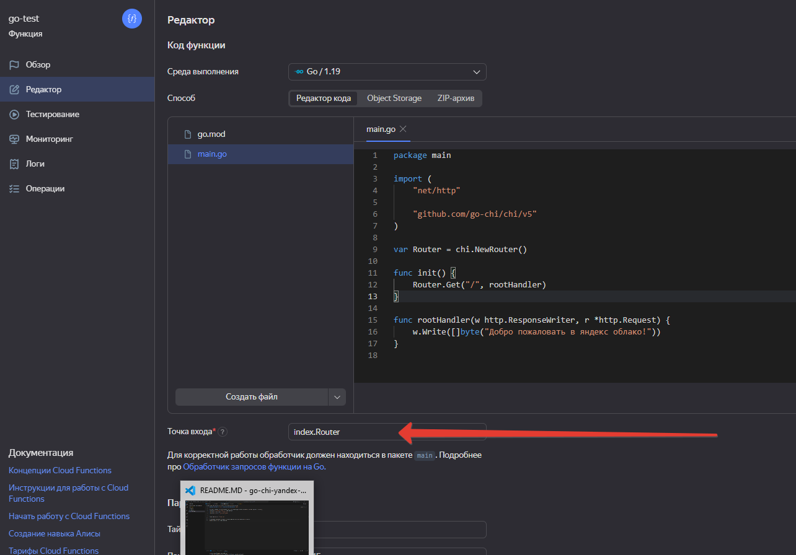
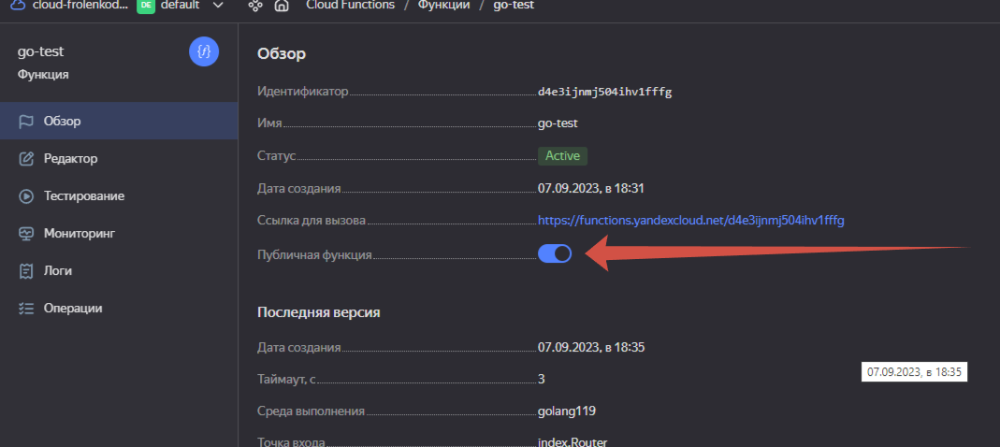
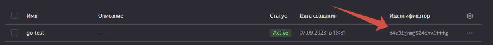
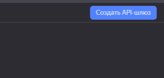
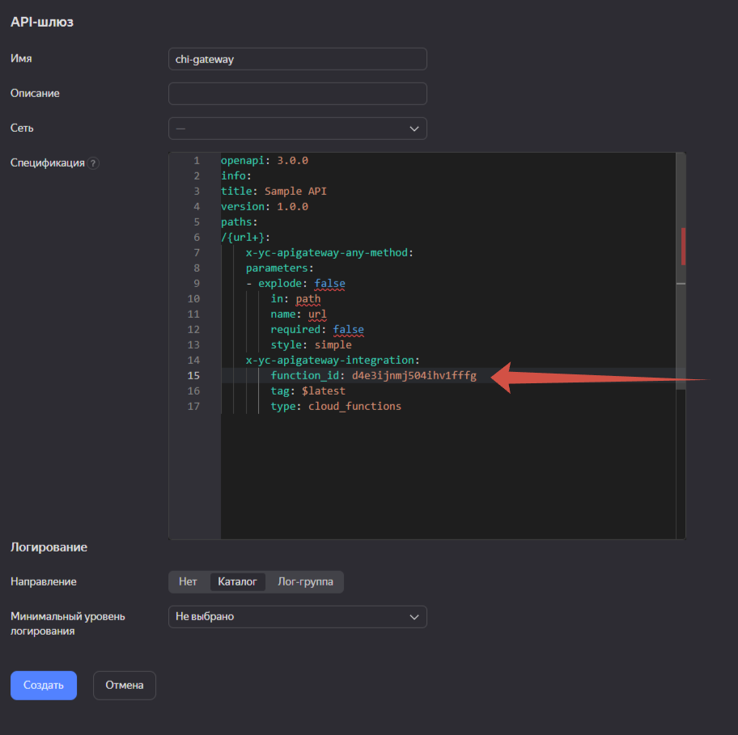
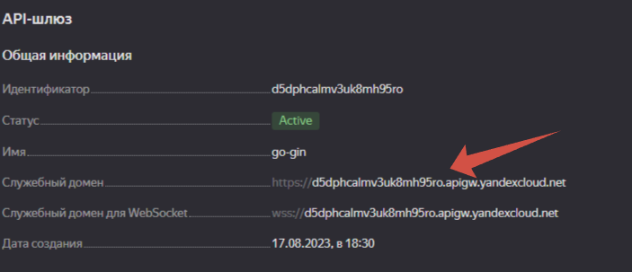
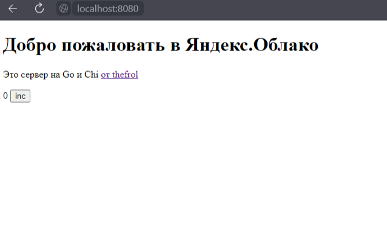

# `Vue.js petite` страница в Яндекс облаке за пять минут на `Go`

Как запустить сервер в Яндекс облаке с использованием библиотеки `Chi` и поддержкой `petite Vue.js`
----

`Petite Vue.js` это супер-маленький (6кб) веб-фреймворк с поддержкой всего, что нужно. Очень удобно разместить его в Функции, чтобы например, редактировать конфиги или ещё. Чего. В итоге у вас будет и апи и веб интерфейс в одной функции. 

И все это за пять минут разворачивается в облаке. 

Для пользователей `Виндоус` рекомендую для заливки в облако использовать [этот скрипт](https://github.com/thefrol/powershell-yandexcloud-function-uploader). В одно касание задеплоит функцию в облако. Работай в любимом IDE и не морочься с архивами и веб интерфейсом. 

# Что здесь?

Через пять минут вы получите готовый сервер вида `https://<много_букв>.apigw.yandexcloud.net/`, который хостит веб сайт из директории `web`. А в файле `index.html` уже настроена версия `Petite Vue.js`.

Вы можете определить любые маршруты для своего апи, они будет олично вызываться.

# Установка

Перед вами простой шаблон, который позволит запустить `Vue.js` страничку в облаке. Делается за минуту:
+ Загрузите `go.mod` и `main.go` и папку `web` в вашу функцию(например, архивом)
+ Поставьте точка входа - `main.Router`
    
+ Поставьте галочку `публичная функция`
    


Потом перейдите на `https://functions.yandexcloud.net/d4e3...`(написан там где галочку ставили). Вы победили!

## Стоп! Это ещё не все

Чтобы у нас работало, что-то кроме одного маршрута, мы добавим `Api Gateway`. Там все очень просто. 

Это делается на тот, случай если ты решишь, что тебе нужен ещё например такой адрес `/info`

```go
router.Get(/info, infoHandler)
```

1. Запомнить идентификатор функции. Или в адресе `https://functions.yandexcloud.net/<идентификатор>`, или в списке всех функций
    
1. Перейдем в сервис `Api Gateway` в яндекс облаке и создадим новый гейт
    
2. Запишем такую конфигурацию в окне создания шлюза, и поменяем строчку `function_id` на полученный в первом пунтке идентификатор

    ```openapi
    openapi: 3.0.0
    info:
      title: Sample API
      version: 1.0.0
    paths:
      /{url+}:
        x-yc-apigateway-any-method:
          parameters:
          - explode: false
            in: path
            name: url
            required: false
            style: simple
          x-yc-apigateway-integration:
            function_id: твой_идентификатор
            tag: $latest
            type: cloud_functions
    ```

    
4. Теперь твоя функция работает по такому адресу `https://d5dphasdln.apigw.yandexcloud.net`, его можно посмотреть в поле служебный домен на открывшейся странице
    

# Готово! 🙌

Вот такую картинку вы увидите в конце



## Что дальше?

### Разработай свой апи

Добавь пару маршрутов со своими хендлерами

```go
Router.Get("/users", listUsersHandle)
Router.Post("/user", setUserHandle)
```

### Форкни!

Форкните на гитхабе и установите себе локально репозиторий, чтобы можно было работать с кодом. 


Ещё вот есть интересный [гайд по git](https://habr.com/ru/articles/541258/) или прекрасный [курс на Яндекс.Практикуме](https://practicum.yandex.ru/git-basics/)

### Установить локально

1. зайдите в папку
2. скачайте в нее репозиторий
    ```bash
    git clone https://github.com/<ваше_имя>/<ваш_репозиторий> .
    ```

### Локальный запуск

Для тестирования предусмотрен локальный запуск. 

```
go run .
```

Сервер будет ждать на `http://localhost:8080`

### Планы

В дальнейшем планируется добавить полезных функций для чтения контекста, и прочего.
Записать видео, как создать функцию
поддержка статических файлов

# Автор

За основу взят [шаблон попроще](https://github.com/thefrol/go-chi-yandex-cloud-template)

Дмитрий Фроленко 2023
